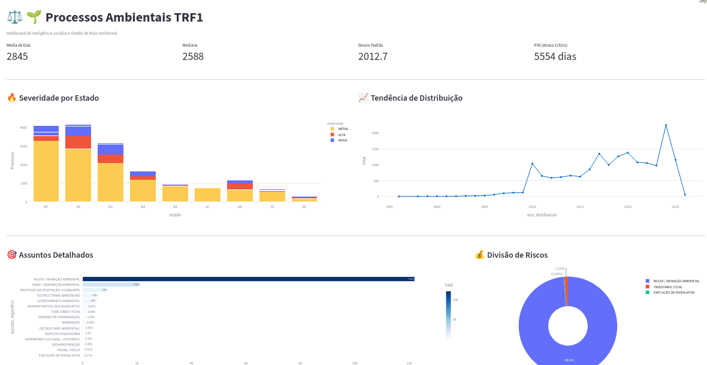

# 📚 Data Analytics com ETL

Projeto para exemplificar o trabalho de engenharia e análise de dados, utilizando extração de indicadores de processos ambientais em trâmite no TRF-1 (Amazônia Legal). A base de dados foi reduzida da original (que inclui mais de 80 mil processos) para fins didáticos, pois o foco do repositório é demonstrar como trabalhar com os dados extraídos da API DataJud e coletados com mais detalhes pelo número do processo, por meio de webscraping no portal PJe. 

Neste projeto, transforma-se dados brutos em uma camada analítica performática utilizando DuckDB e Parquet. A pipeline simulou uma arquitetura medallion (camada bronze, silver e gold). 

🏢 Arquitetura

    Engine: DuckDB (Processamento OLAP em memória)

    Armazenamento: Arquivos colunares Parquet (otimização de I/O)

    Backend: FastAPI

    Data Wrangling: Pandas e Regex (normalização e anonimização de dados semi-estruturados)

📈 Insights Analíticos Incluídos

    Ranking de Litigiosidade: Identificação das empresas com maior volume de processos.

    KPI de Performance: Tempo médio de tramitação por estado, maiores litigantes por região, porte e assunto.

    Detecção de Sazonalidade: Volume de novos processos ao longo do tempo.

🛠 Como executar

    Instale as dependências: pip install -r requirements.txt

    Processe os dados: python src/pipeline/main.py

    Suba a API: uvicorn src.app.api:app --reload

    Acessar os endpoints: http://127.0.0.1:8000/docs

    Visualizar gráficos: streamlit run src/dashboard/dashboard.py 

🧪 Por que DuckDB?

Escolhi o DuckDB por sua capacidade de executar consultas SQL complexas diretamente em arquivos Parquet, sendo ideal para cenários de Data Analytics onde a performance de leitura e agregação é prioridade, sem a necessidade de um servidor de banco de dados tradicional. Alternativa open source e gratuita.

📊 Visualização dos Dados (Dashboard)

Uma demonstração do dashboard interativo desenvolvido com Streamlit:

------------------------------------------
OBS: Os dados contidos no projeto não são representativos do todo e compreendem menos de 5% dos casos. A amostra foi escolhida aleatoriamente, sem considerar proporcionalidade nos recortes, para fins meramente educacionais.

Informações pessoais foram removidas ou substituídas por identificadores fictícios, em conformidade com a LGPD (Lei nº 13.709/2018). Vale destacar que os dados sobre as partes envolvidas foram obtidos de webscraping no site do PJe do TRF-1.